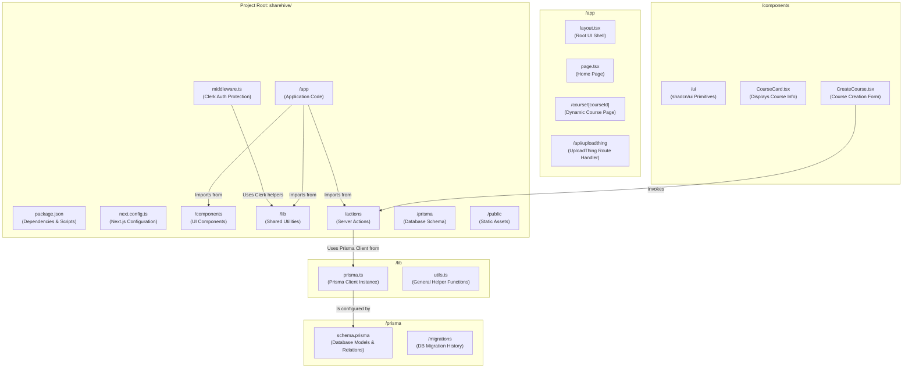

# 1. System Architecture

This document provides a detailed overview of the ShareHive system architecture, including the project's file structure and the high-level interactions between its various components and third-party services.

**[◄ Back to Overview](./overview.md)**

### Table of Contents
1. [High-Level System Diagram](#1-high-level-system-diagram)
2. [Technology and Service Roles](#2-technology-and-service-roles)
3. [Project File Structure](#3-project-file-structure)

---

### 1. High-Level System Diagram

The following diagram illustrates the overall architecture, showing the relationships between the client, our Next.js backend, and the specialized third-party services we rely on.

```mermaid
graph TD
    subgraph "Client (User's Browser)"
        A[React UI Components]
    end

    subgraph "Application Layer (Vercel)"
        B[Next.js Frontend]
        C[Next.js Backend]
    end
    
    subgraph "Data & Services Layer"
        D[Clerk User Management]
        E[Neon DB (PostgreSQL)]
        F[UploadThing File Storage]
    end

    A -- "HTTPS Requests" --> B
    A -- "Interactive Auth Flow" --> D
    A -- "Direct File Upload (Presigned URL)" --> F
    
    B -- "Renders" --> A
    B -- "Invokes" --> C
    
    C -- "Validates Session (JWT)" --> D
    C -- "CRUD Operations (Prisma ORM)" --> E
    C -- "Authorizes Uploads & Receives Webhooks" --> F
```

### 2. Technology and Service Roles

| Component | Technology/Service | Role |
| :--- | :--- | :--- |
| **Client** | React / Next.js | Renders the UI, handles user interactions, and initiates requests for authentication and file uploads. |
| **Frontend** | Next.js / Vercel | Serves static assets, renders Server Components, and provides the client-side JavaScript for Client Components. |
| **Backend** | Next.js (API Routes / Server Actions) / Vercel | Hosts the application's business logic, processes data, and securely communicates with the data layer. |
| **Authentication** | Clerk | Manages all aspects of user identity, including sign-up, sign-in, session management (JWT), and user profile data. |
| **Database** | PostgreSQL (Neon DB) + Prisma ORM | Provides persistent storage for application data (users, courses, etc.). Prisma serves as the type-safe data access layer. |
| **File Storage** | UploadThing | Manages secure file uploads, storage, and delivery via a CDN. |

### 3. Project File Structure

The diagram below maps out the entire `sharehive` project directory, explaining the purpose of each key file and folder.



#### File/Folder Descriptions

- **`package.json`**: Defines all project dependencies (e.g., `next`, `react`, `prisma`, `clerk`) and npm scripts (e.g., `dev`, `build`, `start`).
- **`next.config.ts`**: Configuration file for the Next.js framework, including any build-time or runtime settings.
- **`middleware.ts`**: Contains the Clerk middleware, which intercepts incoming requests to enforce authentication and protect routes. It runs on the Edge for high performance.
- **`/app`**: The core of the application, following the Next.js App Router paradigm.
  - **`layout.tsx`**: The root layout component that wraps all pages, typically including the main navigation and theme providers.
  - **`/course/[courseId]`**: A dynamic route where each course is displayed. The `[courseId]` segment is populated at runtime.
  - **`/api/**`**: Contains all API route handlers. These are server-side endpoints for tasks like handling webhooks or specialized client-side requests.
- **`/components`**: Houses all reusable React components.
  - **`/ui`**: Contains the unstyled, primitive components provided by `shadcn/ui` (e.g., `Button`, `Card`, `Input`).
  - **`CreateCourse.tsx`**: A Client Component containing the form for creating a new course. It uses a Server Action to submit data.
- **`/lib`**: A directory for shared library code and helper functions.
  - **`prisma.ts`**: Initializes and exports a singleton instance of the Prisma Client, ensuring efficient database connection management.
- **`/actions`**: Home for all Next.js Server Actions. These are server-side functions that can be directly called from client-side components, primarily for data mutations (Create, Update, Delete).
- **`/prisma`**: Contains all database-related files.
  - **`schema.prisma`**: The single source of truth for the database schema. It defines all models, fields, and relations.
  - **`/migrations`**: Stores the SQL migration files generated by Prisma, providing a version history of the database schema.
- **`/public`**: A directory for static assets like images, fonts, and SVGs that are served directly from the root of the site.

---
**[◄ Back to Overview](./overview.md)**