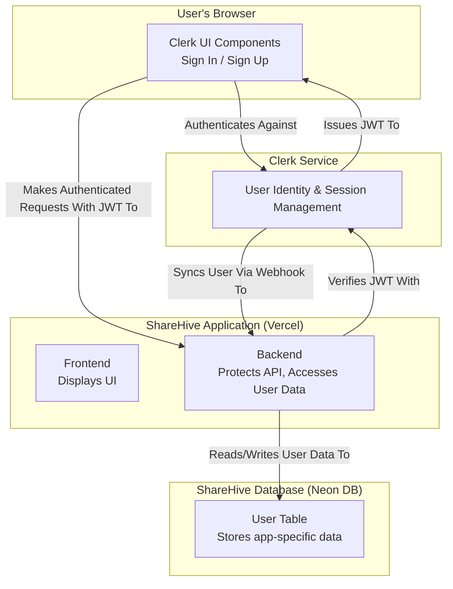
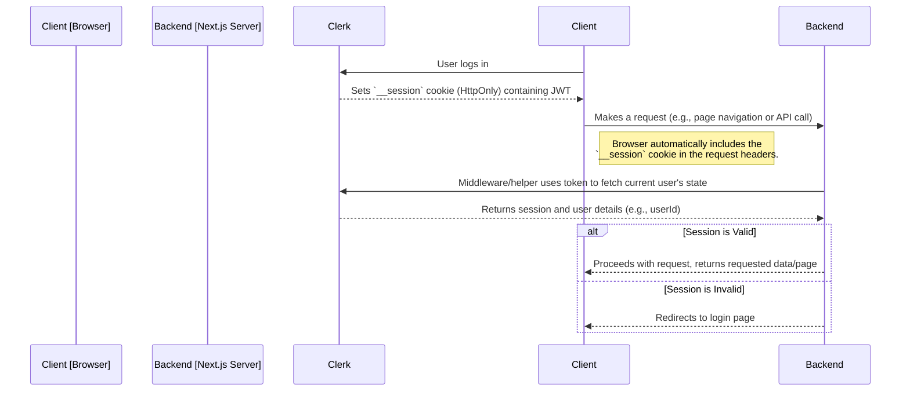
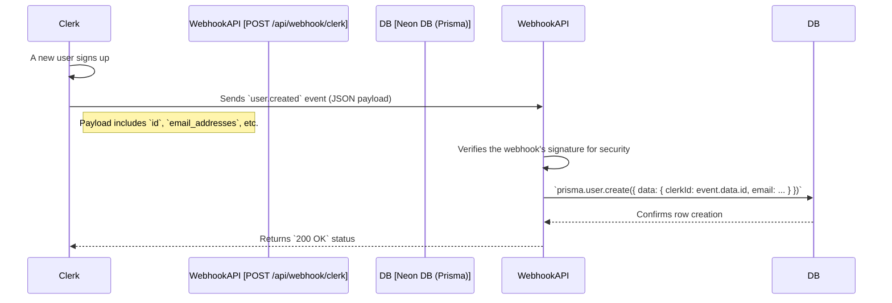

# 4. Authentication System

This document provides a detailed analysis of the user authentication and management system in ShareHive, which is powered by **Clerk**. It covers session management, route protection, and the synchronization of user data with our application's database.

**[◄ Back to Overview](./overview.md)**

### Table of Contents
1. [Authentication Model](#1-authentication-model)
2. [Session Management and JWT Flow](#2-session-management-and-jwt-flow)
3. [Route Protection with Middleware](#3-route-protection-with-middleware)
4. [User Data Synchronization](#4-user-data-synchronization)

---

### 1. Authentication Model

We use a third-party, "delegated" authentication model. Clerk handles all security-sensitive operations, while our application backend trusts Clerk as the source of truth for user identity.



| Component | Responsibility |
| :--- | :--- |
| **Clerk UI** | Renders login/signup forms and manages user interactions. |
| **Clerk Service** | Creates users, validates credentials, issues JSON Web Tokens (JWTs), and manages sessions. |
| **ShareHive Backend** | Verifies JWTs from incoming requests and synchronizes user profiles into its own database via webhooks. |

### 2. Session Management and JWT Flow

Clerk uses JWTs to manage sessions. When a user logs in, Clerk's service generates a short-lived session token and stores it in a secure, `HttpOnly` cookie. This token is automatically included in all subsequent requests to our Next.js backend.



### 3. Route Protection with Middleware

We use Clerk's middleware to protect routes that require authentication. The logic is defined in `middleware.ts` and runs on Vercel's Edge network for maximum performance.

- **File**: `middleware.ts`
- **Purpose**: To intercept incoming requests before they reach our application code and enforce authentication rules.

```mermaid
graph TD
    A[Incoming Request] --> B{middleware.ts};
    B -- "Is it a protected route?" --> C{createRouteMatcher};
    C -- "Yes" --> D{auth().protect()};
    C -- "No" --> E[Allow Request];
    D -- "Is user authenticated?" --> F{Valid JWT?};
    F -- "Yes" --> E;
    F -- "No" --> G[Redirect to Sign-In Page];
```
This server-side protection ensures that unauthorized users can never access sensitive data or pages, even if they attempt to bypass client-side routing.

### 4. User Data Synchronization

To link Clerk users with data in our own application (like courses or comments), we maintain a `User` table in our PostgreSQL database. This table is kept in sync with Clerk's user database via webhooks.

- **Trigger**: An event in Clerk (e.g., `user.created`, `user.updated`).
- **Endpoint**: An API route in our application (`/api/webhook/clerk`) that listens for these events.



This automated process ensures that for every user in Clerk, there is a corresponding entry in our application's database that we can use to establish relationships (e.g., which user created which course).

---
**[◄ Back to Overview](./overview.md)**