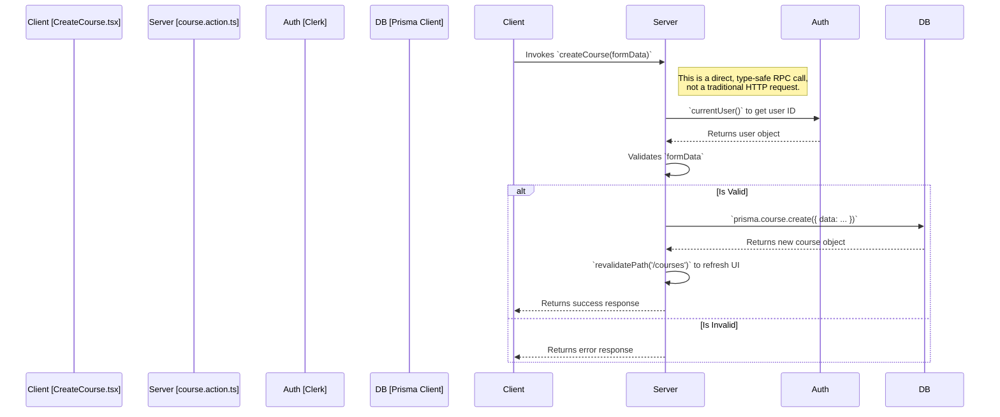
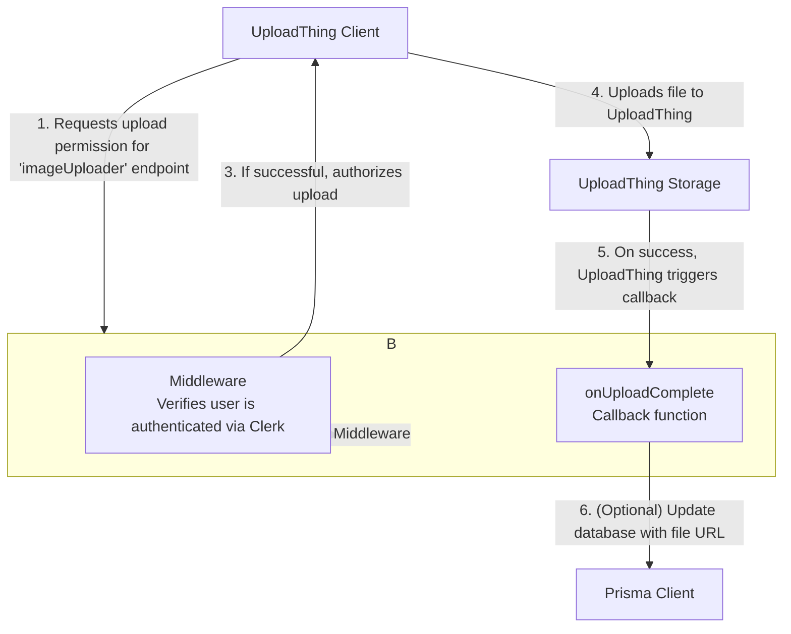

# 2. Components & Logic

This document provides a detailed breakdown of the application's key components, including UI components, Server Actions, and API Routes. Each component's purpose, technology, and interactions are described.

**[◄ Back to Overview](./overview.md)**

### Table of Contents
1. [UI Components](#1-ui-components)
   - [CreateCourse.tsx](#createtcourse-tsx)
   - [CommentSection.tsx](#commentsection-tsx)
   - [ImageUpload.tsx](#imageupload-tsx)
2. [Backend Logic Components](#2-backend-logic-components)
   - [Server Action: `course.action.ts`](#server-action-courseactionts)
   - [API Route: `api/uploadthing/core.ts`](#api-route-apiuploadthingcorets)

---

### 1. UI Components

UI components are the building blocks of the user interface. They are located in the `/components` directory.

#### `CreateCourse.tsx`

- **Purpose**: A client-side form that allows users to create a new course.
- **Technology**: React, `useState` hook, shadcn/ui (`Input`, `Button`), React Hot Toast.
- **Interaction Flow**: This component captures user input and uses a Server Action (`createCourse`) to submit the data to the backend. It does not directly interact with the database.

```mermaid
graph TD
    subgraph "CreateCourse.tsx (Client Component)"
        A["React State (useState)<br/>Manages form input values"]
        B["UI (JSX)<br/>Renders <form>, <Input>, <Button>"]
        C["Form Submission Handler<br/>Invokes Server Action"]
    end
    
    subgraph "Backend"
       D["course.action.ts<br/>(Server Action)"]
    end

    A -- "Populates" --> B
    B -- "On Submit" --> C
    C -- "Calls `createCourse` with FormData" --> D
    D -- "Returns Success/Error" --> C
    C -- "Triggers Notification" --> E[React Hot Toast]
```

#### `CommentSection.tsx`

- **Purpose**: Displays a list of comments for a course and provides a form for adding a new comment.
- **Technology**: React, Server Action (`comment.action.ts`).
- **Interaction Flow**: The initial list of comments is passed down as props from a parent Server Component. New comments are submitted via a Server Action.

```mermaid
graph TD
    subgraph "Parent Page (Server Component)"
        P["prisma.comment.findMany(...)"]
    end

    subgraph "CommentSection.tsx (Client Component)"
        A["Props<br/>Receives initial comments"]
        B["UI (JSX)<br/>Renders comments and a <form>"]
        C["Form Handler<br/>Invokes `addComment` Server Action"]
    end
    
    subgraph "Backend"
        D["comment.action.ts<br/>(Server Action)"]
    end

    P -- "Passes initial data" --> A
    A -- "Renders" --> B
    B -- "On Submit" --> C
    C -- "Calls `addComment`" --> D
```

#### `ImageUpload.tsx`

- **Purpose**: Provides a UI for uploading an image file. It is a wrapper around the UploadThing component.
- **Technology**: UploadThing React library.
- **Interaction Flow**: This component handles the client-side part of the file upload process. It communicates with our backend to get authorization and then uploads the file directly to UploadThing's storage.

- **For a detailed diagram of the full upload flow, see [File Uploads](./file-uploads.md).**

---

### 2. Backend Logic Components

These components handle the application's business logic on the server.

#### Server Action: `course.action.ts`

- **Purpose**: A collection of server-side functions for course-related data mutations (Create, Update, Delete).
- **Technology**: Next.js Server Actions, Prisma ORM.
- **Interaction Flow**: These functions are called directly from client components. They are responsible for validating data, interacting with the database, and triggering UI updates.

##### `createCourse` Function Flow:

#### API Route: `api/uploadthing/core.ts`

- **Purpose**: The central configuration file for UploadThing. It defines the "file routes" that control file upload permissions and server-side logic.
- **Technology**: UploadThing library, Next.js API Routes.
- **Interaction Flow**: This is not called directly by our UI. Instead, the UploadThing client package communicates with this endpoint to authorize uploads. It also defines the `onUploadComplete` callback that runs on our server after a file is successfully uploaded.

##### `imageUploader` File Route Logic:

---
**[◄ Back to Overview](./overview.md)**
