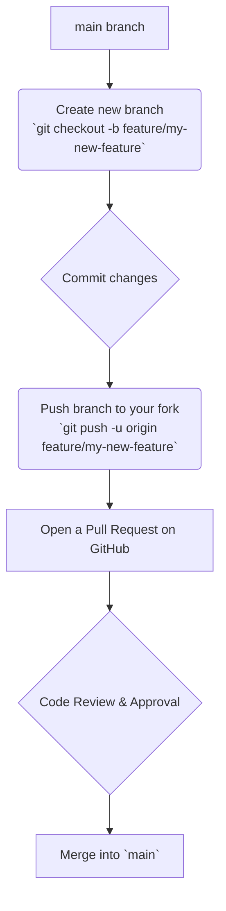

# 9. Contribution Guidelines

Thank you for your interest in contributing to the ShareHive project. To ensure a smooth and collaborative development process, please follow the guidelines outlined in this document.

**[◄ Back to Overview](./overview.md)**

### Table of Contents
1. [Development Environment Setup](#1-development-environment-setup)
2. [Git Workflow](#2-git-workflow)
3. [Coding Standards](#3-coding-standards)
4. [Handling Database Migrations](#4-handling-database-migrations)
5. [Submitting a Pull Request](#5-submitting-a-pull-request)

---

### 1. Development Environment Setup

1.  **Fork & Clone**: Fork the repository on GitHub and clone your fork to your local machine.
    ```bash
    git clone https://github.com/<your-username>/sharehive.git
    cd sharehive
    ```
2.  **Install Dependencies**: Use `npm` to install the required packages.
    ```bash
    npm install
    ```
3.  **Configure Environment Variables**:
    - Create a `.env` file by copying the example file: `cp .env.example .env`.
    - You will need to create your own free developer accounts for the following services and populate the `.env` file with your credentials:
      - **Clerk**: For user authentication.
      - **Neon DB**: For your PostgreSQL database.
      - **UploadThing**: For file uploads.
4.  **Run Initial Migration**: Apply all existing database migrations to your local Neon DB instance.
    ```bash
    npx prisma migrate dev
    ```
5.  **Start the Development Server**:
    ```bash
    npm run dev
    ```
    The application should now be running at `http://localhost:3000`.

### 2. Git Workflow

We use a feature-branch workflow. All new work should be done on a dedicated branch.



- **Branch Naming**: Use a prefix like `feature/`, `fix/`, or `docs/` followed by a short, descriptive name (e.g., `feature/user-profile-page`).
- **Keep `main` Clean**: The `main` branch is our source of truth and should always be in a deployable state. Do not commit directly to `main`.

### 3. Coding Standards

- **Language**: All code must be written in **TypeScript**.
- **Linter & Formatter**: We use **ESLint** for code quality and **Prettier** for formatting. Please configure your editor to use these tools, and ensure your code is free of linting errors before submitting.
- **Component Structure**:
    - Follow the existing patterns in the `/components` directory.
    - Use Server Components by default. Only add the `'use client'` directive when client-side interactivity (state, effects, event listeners) is required.
- **Naming**:
    - **Files**: `kebab-case.ts` or `kebab-case.tsx`.
    - **Components**: `PascalCase`.
    - **Variables/Functions**: `camelCase`.

### 4. Handling Database Migrations

If your feature requires a change to the database schema, you must create a new migration.

1.  **Modify the Schema**: Make your desired changes in the `prisma/schema.prisma` file.
2.  **Generate Migration Files**: Run the `migrate dev` command. This will generate a new SQL migration file in the `prisma/migrations` directory. **Provide a descriptive name** for the migration when prompted.
    ```bash
    npx prisma migrate dev --name add-user-avatar-field
    ```
3.  **Commit Migration Files**: The generated migration directory (e.g., `2025..._add_user_avatar_field`) **must be committed** to Git along with your `schema.prisma` changes. This is how the changes will be applied by other developers and in the production deployment pipeline.

### 5. Submitting a Pull Request

1.  **Create the PR**: Open a pull request from your feature branch to the `main` branch of the upstream repository.
2.  **Title and Description**:
    - The title should be a concise summary of the changes (e.g., "Feature: Add User Profile Page").
    - The description should clearly explain:
        - **What** the change is.
        - **Why** the change was made.
        - How to **test** the change.
3.  **Review Process**: A project maintainer will review your PR. Be prepared to discuss your changes and make adjustments based on the feedback.
4.  **Merge**: Once approved, your PR will be squashed and merged into the `main` branch, and your changes will be deployed to production automatically.

---
**[◄ Back to Overview](./overview.md)**