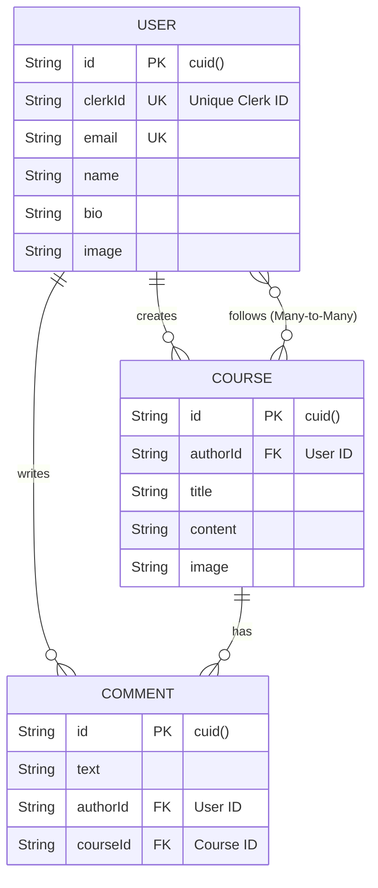
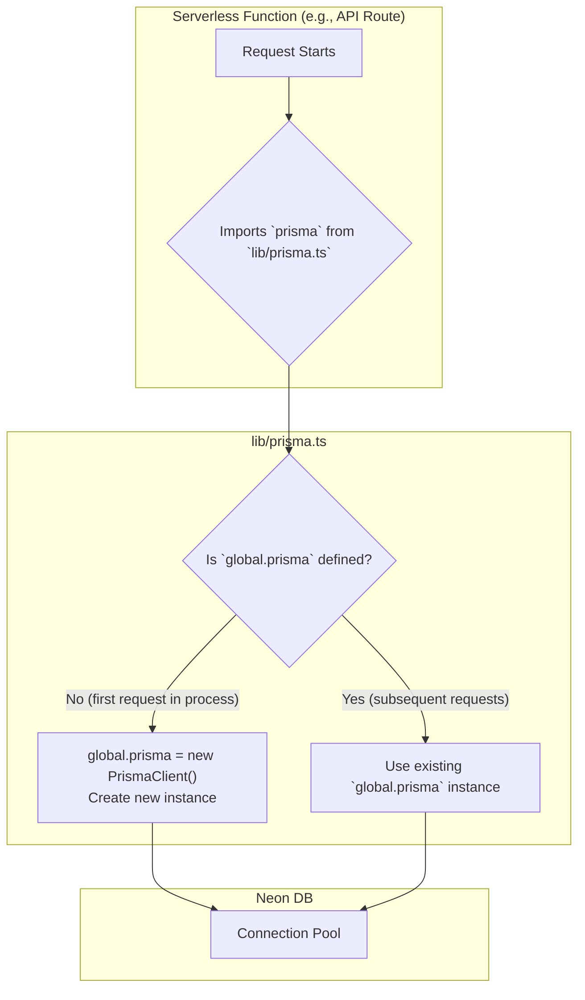

# 5. Database & Schema

This document details the database architecture for ShareHive, focusing on the Prisma ORM configuration, the PostgreSQL schema, and the connection to our Neon DB instance.

**[◄ Back to Overview](./overview.md)**

### Table of Contents
1. [Database Technology Stack](#1-database-technology-stack)
2. [Prisma Schema Diagram](#2-prisma-schema-diagram)
3. [Model and Relationship Details](#3-model-and-relationship-details)
4. [Connection Management (Prisma Client)](#4-connection-management-prisma-client)
5. [Migrations Workflow](#5-migrations-workflow)

---

### 1. Database Technology Stack

| Component | Technology | Purpose |
| :--- | :--- | :--- |
| **Database** | PostgreSQL | A robust, open-source relational database for storing all application data. |
| **Hosting** | Neon DB | A serverless PostgreSQL provider that offers autoscaling and connection pooling, ideal for our Vercel-hosted application. |
| **ORM** | Prisma | A next-generation ORM that provides a type-safe database client and a declarative way to manage our schema and migrations. |

### 2. Prisma Schema Diagram

The following diagram illustrates the models in our `schema.prisma` file and the relationships between them.

- **PK**: Primary Key
- **FK**: Foreign Key
- **UK**: Unique Key

### 3. Model and Relationship Details

The schema is defined in `prisma/schema.prisma`.

#### `User` Model
- **Purpose**: Stores application-specific data for a user, linked to their Clerk identity.
- **Key Fields**:
  - `id`: The internal primary key for our application (`cuid`).
  - `clerkId`: A unique identifier that links this record to a user in the Clerk system. This is the bridge between our auth provider and our database.
- **Relations**:
  - **One-to-Many with `Course`**: A user can create many courses.
  - **One-to-Many with `Comment`**: A user can write many comments.

#### `Course` Model
- **Purpose**: Represents a course created within the application.
- **Key Fields**:
  - `authorId`: A foreign key that establishes a mandatory relationship with the `User` who created it.
  - `onDelete: Cascade` (Prisma): If a `User` is deleted, all of their associated `Course` records are automatically deleted from the database.
- **Relations**:
  - **Many-to-One with `User`**: Each course has exactly one author.
  - **One-to-Many with `Comment`**: A course can have many comments.

#### `Comment` Model
- **Purpose**: Represents a comment made by a user on a specific course.
- **Key Fields**:
  - `authorId`: Foreign key linking to the `User` who wrote the comment.
  - `courseId`: Foreign key linking to the `Course` that was commented on.
  - `onDelete: Cascade` (Prisma): Ensures comments are deleted if their parent user or course is deleted.

#### Many-to-Many Relationship: `User` and `Course` (Follows)
- **Implementation**: Prisma manages this relationship *implicitly*. By defining a `User[]` field on `Course` and a `Course[]` field on `User`, Prisma automatically creates and manages a hidden join table (named `_CourseFollows` by convention) to manage this relationship.
- **Purpose**: Allows a user to "follow" multiple courses, and a course to be "followed by" multiple users.

### 4. Connection Management (Prisma Client)

- **File**: `lib/prisma.ts`
- **Purpose**: To instantiate and export a single, shared instance of the Prisma Client. This is a critical optimization for serverless environments to avoid exhausting database connections.

This pattern ensures that across multiple hot-reloads in development or multiple invocations within the same serverless container, we reuse the same database connection pool.

### 5. Migrations Workflow

We use `prisma migrate` to evolve the database schema safely.

- **Development**:
  1. Modify `schema.prisma`.
  2. Run `npx prisma migrate dev --name <migration-description>`.
  3. This generates a new SQL file in `prisma/migrations/` and applies it to the local database.

- **Production**:
  1. The command `prisma migrate deploy` is included in the `build` script in `package.json`.
  2. During deployment on Vercel, this command is executed automatically.
  3. It applies any pending migration files to the production Neon DB in a non-interactive, safe manner.

---
**[◄ Back to Overview](./overview.md)**
