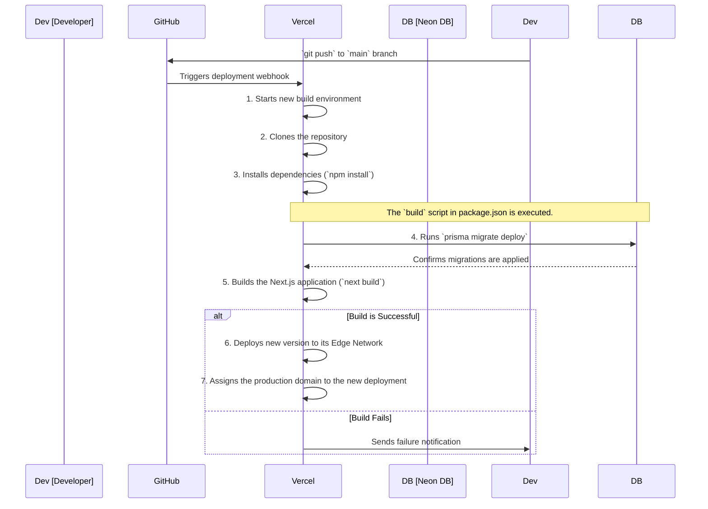

# 8. Deployment & CI/CD

This document outlines the recommended process for deploying the ShareHive application. We use a Continuous Integration and Continuous Deployment (CI/CD) model, leveraging **Vercel** and **GitHub** to automate builds, tests, and deployments.

**[◄ Back to Overview](./overview.md)**

### Table of Contents
1. [Deployment Platform: Vercel](#1-deployment-platform-vercel)
2. [CI/CD Pipeline Diagram](#2-cicd-pipeline-diagram)
3. [Deployment Steps](#3-deployment-steps)
4. [Environment Variables](#4-environment-variables)
5. [Database Migrations in Production](#5-database-migrations-in-production)

---

### 1. Deployment Platform: Vercel

Vercel is our chosen platform for deployment due to its first-class support for Next.js and its robust, automated CI/CD capabilities. It connects directly to our GitHub repository.

### 2. CI/CD Pipeline Diagram

The entire process, from code push to live deployment, is automated.



### 3. Deployment Steps

1.  **Code Commit**: A developer pushes code changes to a feature branch and opens a Pull Request to `main`.
2.  **Code Review & Merge**: After the PR is reviewed and approved, it is merged into the `main` branch.
3.  **Automatic Build Trigger**: The push to `main` automatically triggers a new deployment on Vercel.
4.  **Build Execution**: Vercel executes the `build` command defined in `package.json`.
    - **`package.json` build script**:
      ```json
      "scripts": {
        "build": "prisma generate && prisma migrate deploy && next build"
      }
      ```
    - `prisma generate`: Ensures the Prisma Client is up-to-date with the schema.
    - `prisma migrate deploy`: Applies any pending database migrations.
    - `next build`: Compiles the Next.js application for production.
5.  **Deployment**: If the build step is successful, Vercel deploys the application. Each deployment is immutable and is given a unique URL.
6.  **Production Alias**: Vercel atomically swaps the live production domain to point to the new, successful deployment, ensuring zero downtime.

### 4. Environment Variables

All secrets and environment-specific configuration must be stored in Vercel's project settings, **not** in the repository.

- `DATABASE_URL`: The connection string for the **production** Neon DB instance.
- `CLERK_SECRET_KEY`: Production secret key from Clerk.
- `NEXT_PUBLIC_CLERK_PUBLISHABLE_KEY`: Production publishable key from Clerk.
- `UPLOADTHING_SECRET`: Production secret from UploadThing.
- `UPLOADTHING_APP_ID`: Production App ID from UploadThing.

Vercel securely injects these variables into the build and runtime environments.

### 5. Database Migrations in Production

Handling database migrations is a critical part of the deployment process.

- **Command**: `prisma migrate deploy`
- **Why this command?**: It is specifically designed for production environments. It is non-interactive and will only apply existing migration files from the `prisma/migrations` directory. It will **never** attempt to create new migrations or alter the database in an unexpected way.
- **Execution**: By placing this command in the `build` script, we guarantee that the database schema is updated to match the application code's expectations *before* the new code goes live.

#### Rollback Strategy
- **Application Code**: Vercel makes application rollbacks trivial. Through the dashboard, you can instantly re-promote a previous, immutable deployment to the production domain.
- **Database Migrations**: **Database migrations are not automatically rolled back.** If a faulty migration is deployed, it must be addressed with a new migration that either reverts the changes or fixes the issue. This is why it's critical to test schema changes thoroughly in a staging environment before deploying to production.

---
**[◄ Back to Overview](./overview.md)**