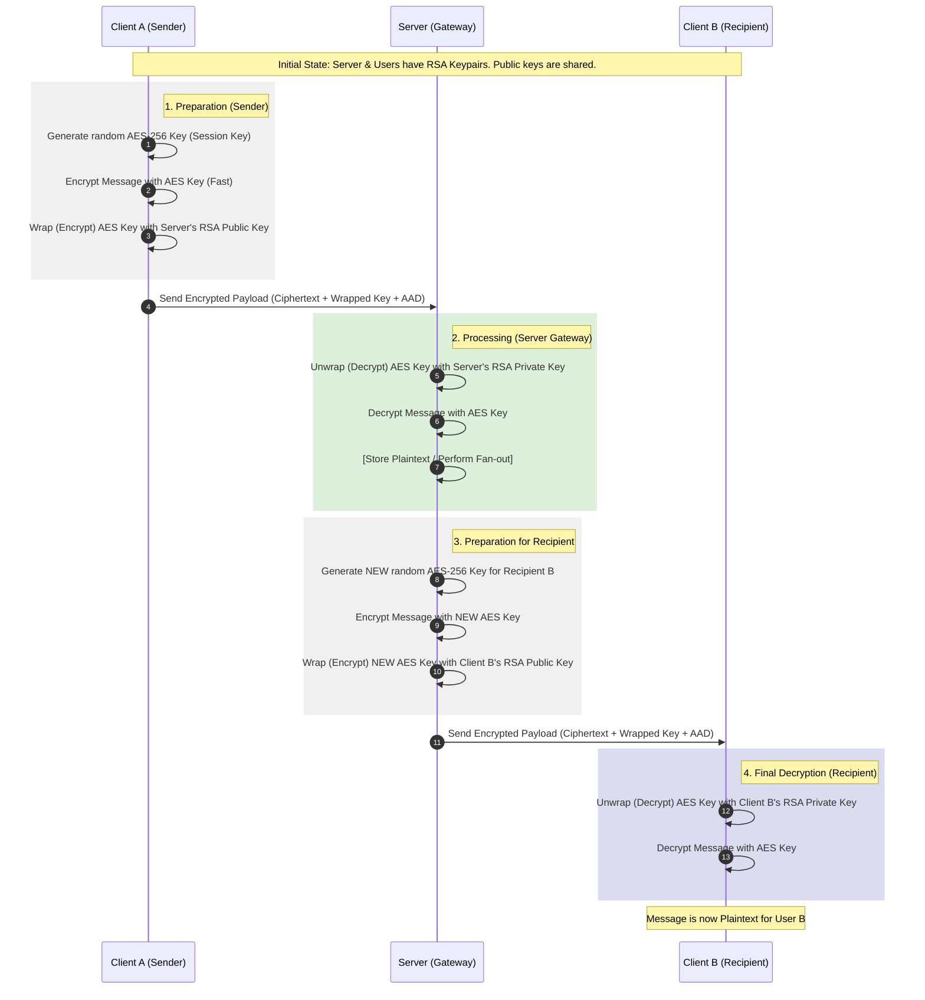

[Back to Index](index.md)

# Visual Flow: RSA & AES Hybrid Encryption

This diagram illustrates how Sharehive uses a combination of **RSA (Asymmetric)** and **AES (Symmetric)** encryption to secure messages while allowing the server to perform necessary distribution (fan-out) tasks.

## The Encryption Lifecycle

---

## Key Components Explained

### 1. The AES "Session" Key
*   **Type**: Symmetric (Same key for lock/unlock).
*   **Role**: Handles the "heavy lifting." It encrypts the actual message content because AES is extremely fast and can handle large amounts of data.
*   **Lifecycle**: A fresh key is generated for every transmission. It is never stored permanently.

### 2. The RSA "Wrapping" Key
*   **Type**: Asymmetric (Public Key locks, Private Key unlocks).
*   **Role**: Handles the "key exchange." It encrypts the small AES key so it can be sent over the internet safely.
*   **Lifecycle**:
    *   **Public Keys**: Distributed freely (Client gets Server's, Server gets Client's).
    *   **Private Keys**: Stay strictly on the device that created them (Client's in IndexedDB, Server's in `.env`).

### 3. AAD (Additional Authenticated Data)
*   **Role**: Prevents "Context Spoofing."
*   **Detail**: We include the `conversationId` and `userId` in the AES-GCM authentication tag. If an attacker tries to move an encrypted message from one conversation to another, the decryption will fail because the AAD won't match.

[Back to Index](index.md)
