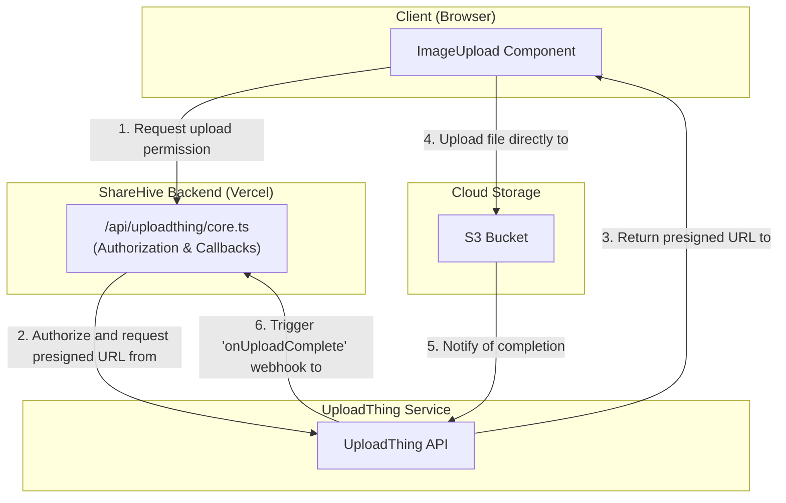
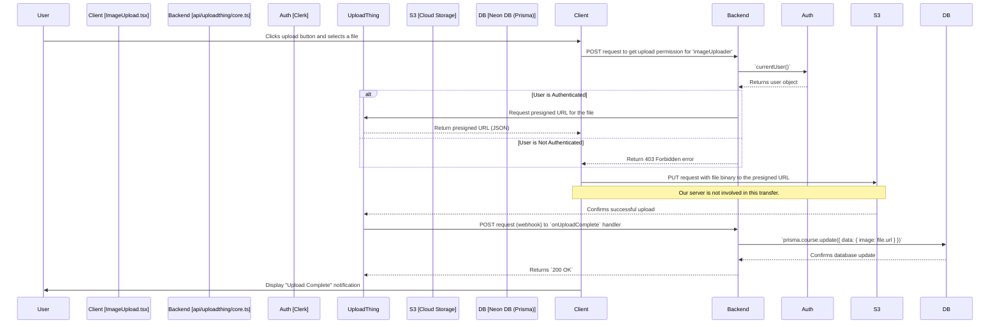

# 6. File Uploads

This document provides a comprehensive explanation of the file upload process in ShareHive, which is managed by **UploadThing**. It covers the entire flow, from the client-side interaction to the server-side processing and final data persistence.

**[◄ Back to Overview](./overview.md)**

### Table of Contents

1. [File Upload Architecture](#1-file-upload-architecture)
2. [End-to-End Upload Sequence Diagram](#2-end-to-end-upload-sequence-diagram)
3. [Component Breakdown](#3-component-breakdown)
   - [Frontend: `ImageUpload.tsx`](#frontend-imageuploadtsx)
   - [Backend: `api/uploadthing/core.ts`](#backend-apiuploadthingcorets)
4. [Data and Storage](#4-data-and-storage)

---

### 1. File Upload Architecture

We use UploadThing to handle file uploads, which follows a **direct client-to-cloud** model. This architecture is highly scalable and performant because the file data does not pass through our application server.

### 2. End-to-End Upload Sequence Diagram

This diagram shows the detailed, step-by-step process for a user uploading a file.

### 3. Component Breakdown

#### Frontend: `ImageUpload.tsx`

- **Purpose**: A client-side React component that provides the UI for file selection and displays the upload progress.
- **Implementation**: It wraps the `<UploadButton />` component provided by the `@uploadthing/react` library.
- **Key Logic**:
  - `endpoint="imageUploader"`: Tells UploadThing which backend file route to use for authorization.
  - `onClientUploadComplete`: A callback function that receives the URL of the uploaded file. This is where we would typically update the client-side state or trigger a form submission.
  - `onUploadError`: Handles any errors that occur during the upload process and displays a notification to the user via React Hot Toast.

#### Backend: `api/uploadthing/core.ts`

- **Purpose**: The server-side configuration for UploadThing. It defines one or more "file routes" that control the logic for different types of uploads.
- **Implementation**: This file exports a `FileRouter` object.

##### `imageUploader` File Route:

- **`f({ image: { maxFileSize: "4MB" } })`**: This line defines the constraints for this route. It only accepts `image` files with a maximum size of 4MB.
- **`.middleware()`**: This function runs on our server _before_ an upload is permitted.
  - It is an `async` function.
  - It uses `currentUser()` from Clerk to check if the user is authenticated.
  - If the user is not logged in, it throws an error, and UploadThing denies the upload request.
  - It returns the user's ID, which can be used in the completion callback.
- **`.onUploadComplete()`**: This function runs on our server _after_ the file has been successfully uploaded to storage.
  - It receives metadata (including the `userId` returned from the middleware) and the `file` object (which contains the `url`).
  - This is the ideal place to save the file URL to our database, for example, by updating the `image` field of a `User` or `Course` record.

### 4. Data and Storage

| Data Type         | Generator   | Transport Format    | Stored At                 | Storage Format              |
| :---------------- | :---------- | :------------------ | :------------------------ | :-------------------------- |
| **File Content**  | User        | `binary`            | UploadThing (S3)          | Original file format        |
| **Presigned URL** | UploadThing | `JSON`              | (Ephemeral) Client memory | URL string                  |
| **File URL**      | UploadThing | `JSON` (in webhook) | Neon DB (PostgreSQL)      | `String` (in `image` field) |

---

**[◄ Back to Overview](./overview.md)**
