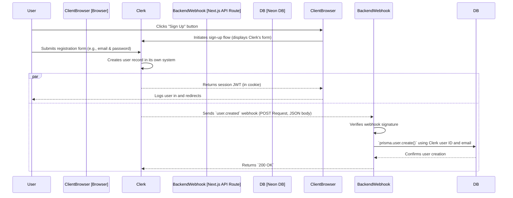
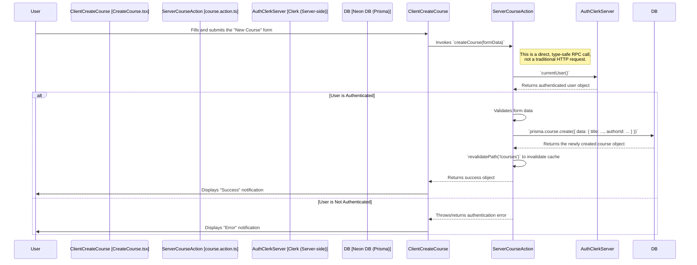
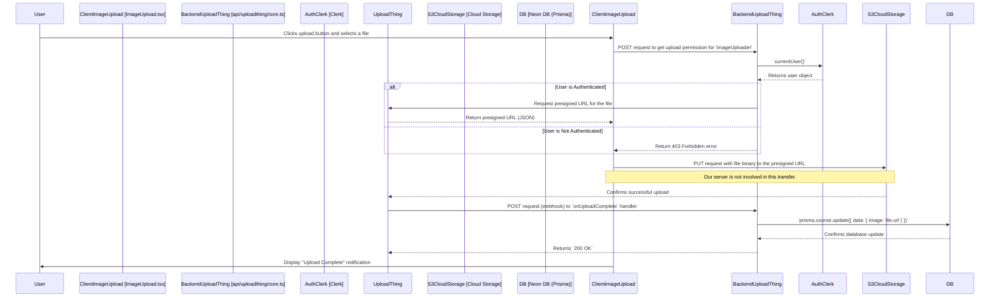
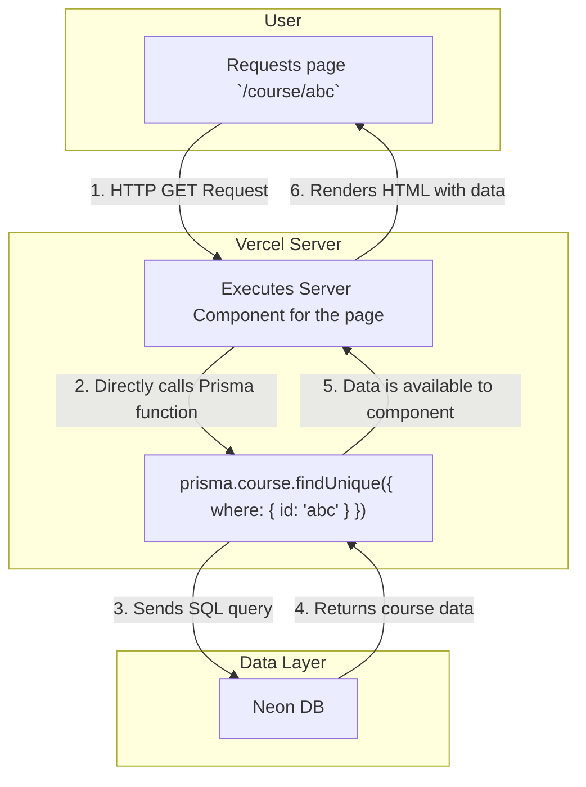

# 3. End-to-End Data Flows

This document provides a detailed, step-by-step visualization of how data moves through the ShareHive system for critical user actions. Each diagram illustrates the sequence of interactions between different parts of our architecture.

**[◄ Back to Overview](./overview.md)**

### Table of Contents

1. [Data Flow: New User Registration](#1-data-flow-new-user-registration)
2. [Data Flow: User Creates a New Course](#2-data-flow-user-creates-a-new-course)
3. [Data Flow: User Uploads a Course Image](#3-data-flow-user-uploads-a-course-image)
4. [Data Flow: Reading Course Data (Server Component)](#4-data-flow-reading-course-data-server-component)

---

### 1. Data Flow: New User Registration

This flow details how a new user is created and how their data is synchronized between Clerk and our application's database.

- **Initiator**: User action.
- **Data Format**: The webhook from Clerk to our backend is a `JSON` payload.
- **Storage**: Clerk stores the primary user identity. Our **Neon DB** stores a corresponding application-level user record, linked by the `clerkId`.

---

### 2. Data Flow: User Creates a New Course

This flow illustrates the use of a Next.js Server Action to handle form submission and create a new database record.

- **Initiator**: User form submission.
- **Data Format**: `FormData` is passed from the client to the Server Action.
- **Storage**: The new course data is stored as a new row in the `Course` table in our **Neon DB**.

---

### 3. Data Flow: User Uploads a Course Image

This flow details the secure file upload process managed by UploadThing, which avoids having the file pass through our application server.

### 4. Data Flow: Reading Course Data (Server Component)

This diagram shows the highly efficient data fetching pattern used for rendering read-only data with Next.js Server Components.

- **Initiator**: User navigation.
- **Data Flow**: This is the most direct flow. The request hits the server, the component runs, fetches data directly from the database, renders HTML, and returns it. There is no client-side JavaScript involved in the data fetching itself.
- **Storage**: Data is read from the **Neon DB**.

---

**[◄ Back to Overview](./overview.md)**
