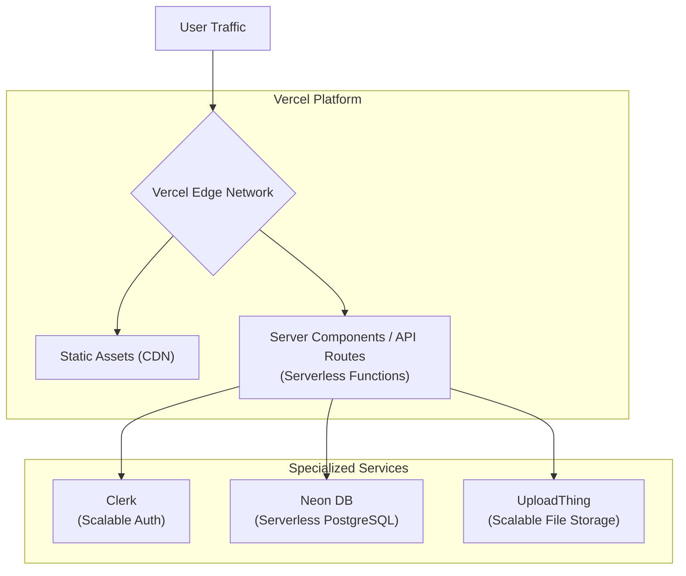
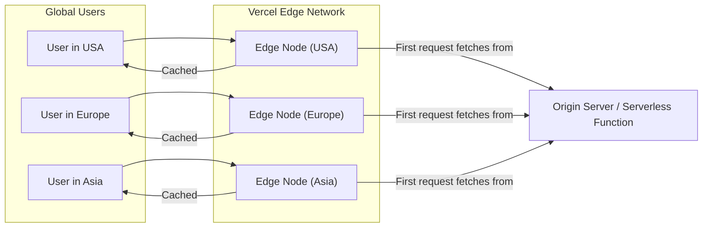
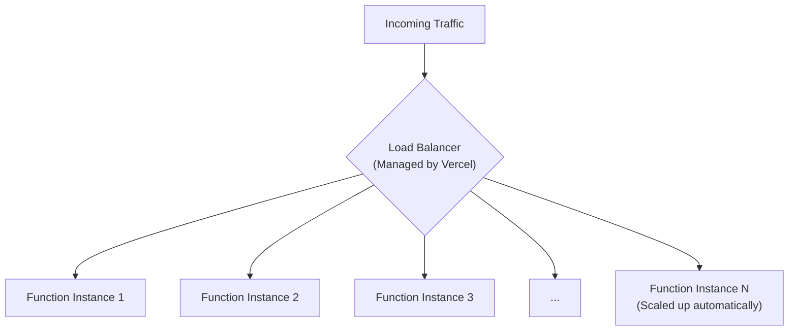
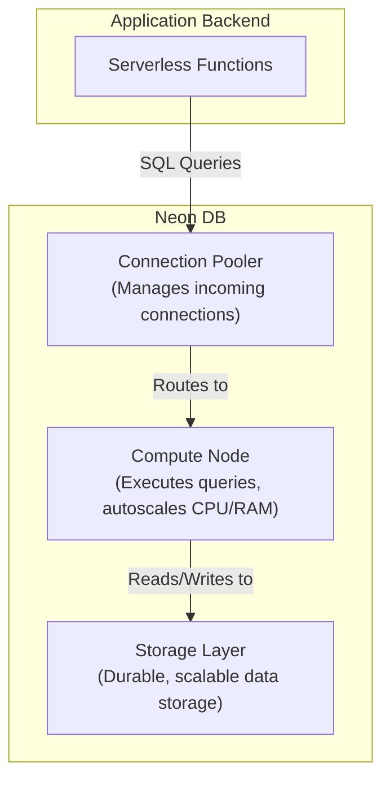

# 7. Scalability & Performance

This document analyzes the scalability and performance characteristics of the ShareHive application. The architecture is built upon serverless and managed services, providing a strong foundation for scaling efficiently.

**[◄ Back to Overview](./overview.md)**

### Table of Contents

1. [Architectural Approach to Scalability](#1-architectural-approach-to-scalability)
2. [Frontend/Edge Scaling](#2-frontendedge-scaling)
3. [Backend Scaling](#3-backend-scaling)
4. [Database Scaling](#4-database-scaling)
5. [Performance Optimization Strategies](#5-performance-optimization-strategies)

---

### 1. Architectural Approach to Scalability

Our scalability strategy is to **distribute load and delegate specialized tasks**. Instead of a single monolithic server, we use a decoupled architecture where each part can scale independently.



- **Vercel Edge**: Handles initial requests, serving cached content globally.
- **Serverless Functions**: Backend logic scales on-demand with traffic.
- **Managed Services**: Database, auth, and file storage each have their own independent, highly scalable infrastructure.

### 2. Frontend/Edge Scaling

- **Platform**: Vercel
- **Mechanism**: Vercel deploys the Next.js application to a global **Edge Network**, which acts as a Content Delivery Network (CDN).



- **Static Assets**: JavaScript, CSS, and images are cached aggressively at the edge, closest to the user, resulting in very low latency.
- **Server-Rendered Pages**: Even dynamically rendered pages can be cached at the edge for a short period, reducing the load on the backend functions.

### 3. Backend Scaling

- **Platform**: Vercel Serverless Functions
- **Mechanism**: Each API Route and Server Action is deployed as an isolated serverless function. Vercel automatically scales the number of running instances of these functions based on real-time demand.



- **Concurrency**: This model allows for massive concurrency. A spike in traffic to one API endpoint does not impact the performance of others.
- **Cost-Effectiveness**: We only pay for compute time when a function is active, making it highly efficient for applications with variable traffic.

### 4. Database Scaling

- **Platform**: Neon DB (Serverless PostgreSQL)
- **Mechanism**: Neon's architecture separates storage and compute, allowing them to scale independently.



- **Autoscaling Compute**: The compute node automatically scales its CPU and RAM resources up or down based on the current query load. It can even scale to zero when idle.
- **Connection Pooling**: Neon's built-in pooler is essential for our serverless backend. It maintains a ready pool of database connections, preventing our serverless functions from overwhelming the database with a high volume of new, short-lived connection requests.

### 5. Performance Optimization Strategies

Beyond the inherent scalability of the architecture, we employ several key performance optimizations.

- **Server Components**: By fetching data on the server and rendering static HTML, we minimize the amount of JavaScript sent to the client. This is our primary strategy for achieving fast initial page loads.
- **Image Optimization**: Using Next.js's `<Image>` component, all images are automatically optimized, resized, and converted to modern formats like WebP. They are also lazy-loaded by default.
- **Lazy Loading Client Components**: For complex, interactive components that are not needed immediately, we use `next/dynamic` to load them asynchronously.

  ```javascript
  import dynamic from "next/dynamic";

  const HeavyComponent = dynamic(() => import("../components/HeavyComponent"));
  ```

  This splits the component's code into a separate JavaScript bundle that is only fetched when the component is about to be rendered.

- **Data Caching**: For data that does not change frequently, we can leverage Next.js's built-in data caching mechanisms to cache the results of database queries, reducing the number of database reads.

---

**[◄ Back to Overview](./overview.md)**
